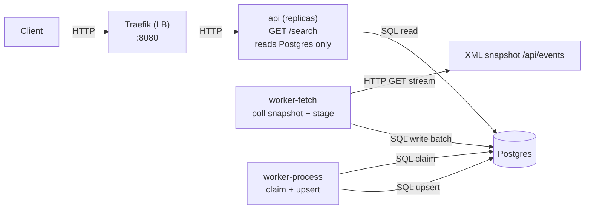

### Architecture Overview

This diagram shows the high-level architecture and the separation of responsibilities between the API and the ingestion pipeline. The API serves `/search` with stable latency because it only reads from Postgres and never calls the external provider at request time. Ingestion is split into `worker-fetch` (poll + stage) and `worker-process` (claim + upsert), allowing horizontal scaling and backpressure while keeping the runtime path simple and predictable.

When scaling the API locally, a lightweight load balancer (Traefik) sits in front of the `api` replicas. This avoids host port collisions (`18080` host -> `8080` container) while still allowing multiple API containers to run.

The process worker claims rows in batches using `FOR UPDATE SKIP LOCKED`, then processes and upserts each claimed row independently. This keeps retries idempotent and isolates failures.

