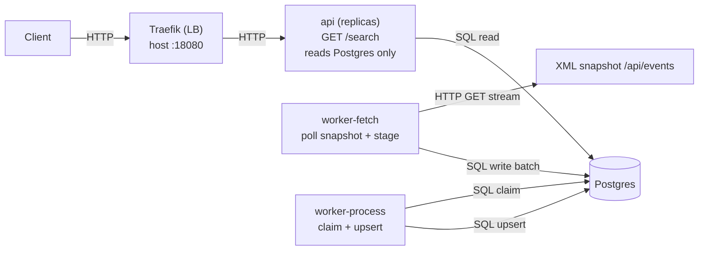

### Architecture Overview

This diagram shows the high-level architecture and the separation of responsibilities between the API and the ingestion pipeline. The API serves `/search` with stable latency because it only reads from Postgres and never calls the external provider at request time. Ingestion is split into `worker-fetch` (poll + stage) and `worker-process` (claim + upsert), allowing horizontal scaling and backpressure while keeping the runtime path simple and predictable.

When scaling the API locally (`make run-scaled`, which layers `deploy/docker-compose.scaled.yml`), a lightweight load balancer (Traefik) sits in front of the `api` replicas: Traefik publishes host port `18080` and the `api` replicas are reachable only inside the compose network. This avoids the host-port collision that multiple `api` containers would otherwise hit. Plain `make run` skips the overlay and publishes the single `api` on `18080` directly.

The process worker claims rows in batches using `FOR UPDATE SKIP LOCKED`, then processes and upserts each claimed row independently. This keeps retries idempotent and isolates failures.

```mermaid
flowchart LR
    P["XML snapshot /api/events"]
    C["Client"]
    T["Traefik (LB)\nhost :18080"]
    API["api (replicas)\nGET /search\nreads Postgres only"]
    WF["worker-fetch\npoll snapshot + stage"]
    WP["worker-process\nclaim + upsert"]
    DB[("Postgres")]

    C -->|HTTP| T;
    T -->|HTTP| API;
    API -->|SQL read| DB;
    WF -->|HTTP GET stream| P;
    WF -->|SQL write batch| DB;
    WP -->|SQL claim| DB;
    WP -->|SQL upsert| DB;
```
