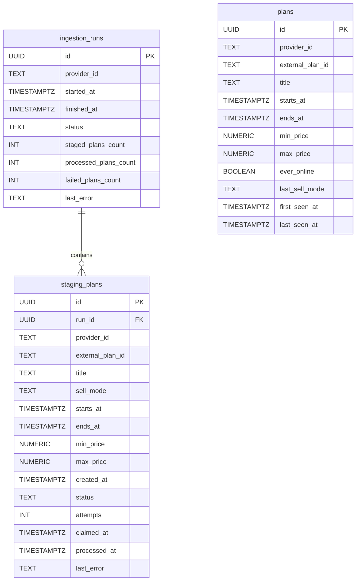

### Data Model

This ERD documents the persistence model and how ingestion is tracked end-to-end. plans stores the canonical, queryable state used by the API, while ingestion_runs and staging_plans act as an auditable “DB queue” for snapshot processing. Separating staging from canonical storage enables scalable processing, operational visibility, and safe recovery after partial failures.

> Known gap: `ingestion_runs.processed_plans_count` and `ingestion_runs.failed_plans_count`
> exist in the schema but are not currently updated by the process worker. They remain
> reserved fields for future run-level processing counters.
