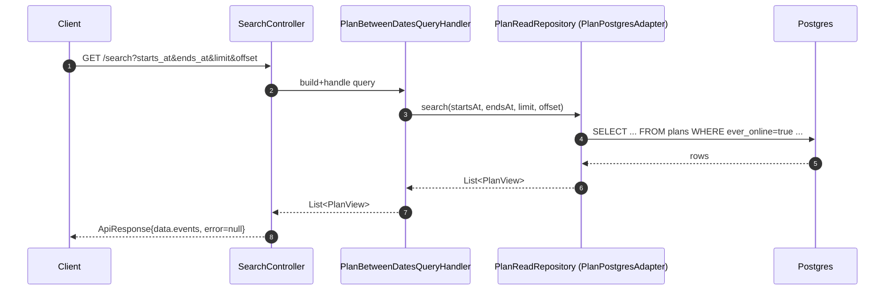
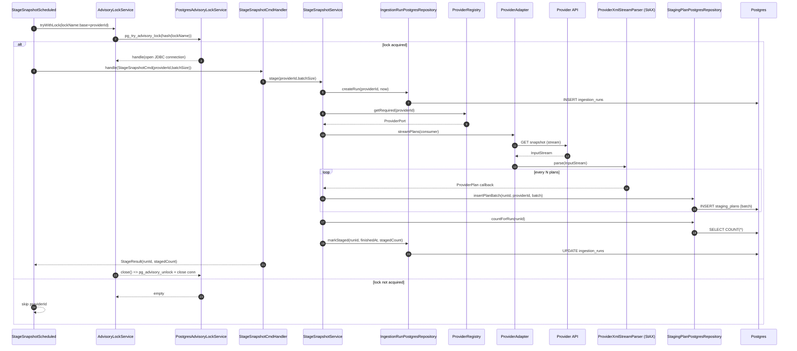
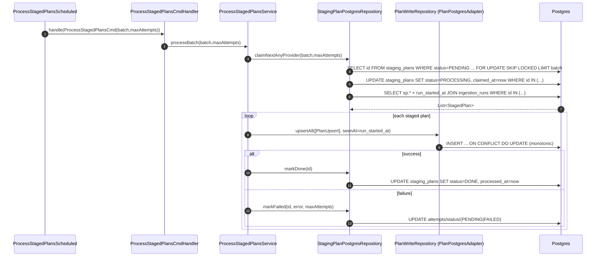

### Search Flow

This sequence captures the request path for /search. The controller validates input, delegates to the query handler, and retrieves results via the read repository from Postgres. The key property is that the request path is fully deterministic and provider-independent: the external provider is never contacted during /search, so response times depend only on the database.

### Staging Flow

This sequence describes how snapshot ingestion starts. The scheduled job acquires a distributed advisory lock (per provider) to prevent overlapping runs, then streams the XML snapshot and stages plans in batches into Postgres. Staging provides auditability and decouples network/parse time from processing time, enabling safe retries and controlled throughput.

### Staging Flow

This sequence shows how staged rows are processed concurrently. Workers atomically claim batches using SELECT … FOR UPDATE SKIP LOCKED, transform each row into the canonical model, and upsert into the plans table. Failed rows are retried up to a configured limit, ensuring at-least-once processing while keeping the system resilient to transient DB/network issues.

