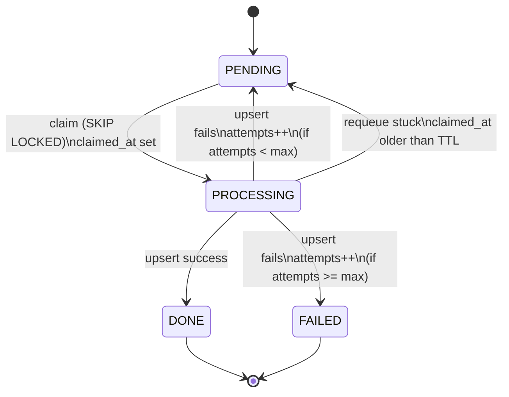

### Staging state machine

This state machine explains the lifecycle of a staged plan row. Rows move from PENDING to PROCESSING when claimed, then to DONE on success or back to PENDING/FAILED on failure depending on the retry budget. The model makes crash recovery explicit: unprocessed work remains in the database and can be picked up by any worker instance.

